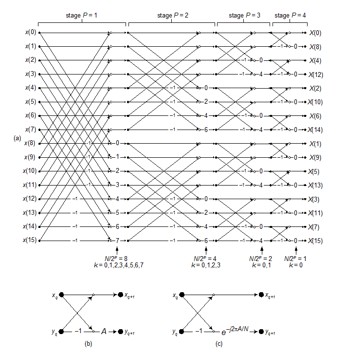
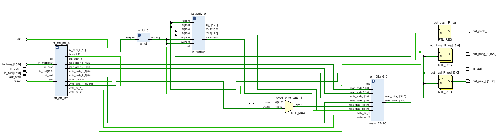
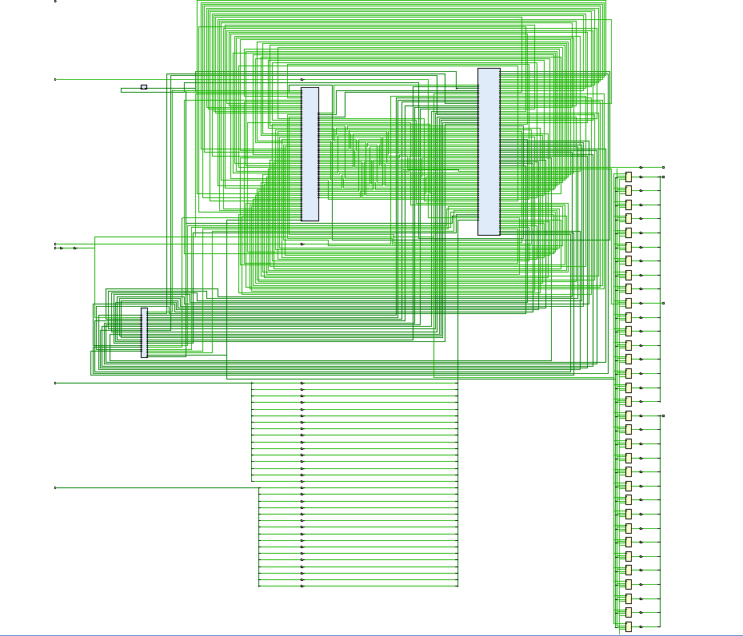
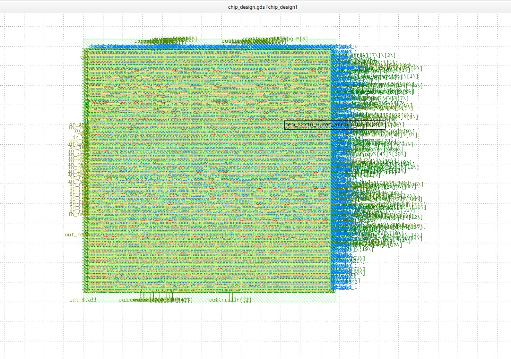

# 16-Point FFT ASIC Design Flow
##  Table of Contents
1. [Introduction](#introduction)
2. [Problem Statement](#problem-statement)
3. [Methodology](#methodology)
    - [Design Architecture](#design-architecture)
    - [Design Flow](#design-flow)
    - [Synthesis ](#synthesis)
    - [Post-Layout Verification](#post-layout-verification)
    - [Tools Used](#tool-used)

4. [Results and Discussion](#results-and-discussion)
5. [Conclusion and Future Work](#conclusion-and-future-work)
6. [Contributions](#contributions)

## Introduction

This repository contains the complete design and implementation of a 16-point Fast Fourier Transform (FFT) ASIC. The FFT is a fundamental algorithm in digital signal processing that efficiently computes the Discrete Fourier Transform (DFT) of a sequence, reducing the computational complexity from O(N²) to O(N log N).

This implementation focuses on optimizing for power efficiency and area constraints while maintaining high throughput for real-time applications. The design employs a radix-2 decimation-in-time (DIT) architecture and has been verified through extensive simulation and physical implementation.

## Problem Statement

Modern signal processing applications demand efficient hardware implementations of FFT algorithms that can deliver:

1. High computational throughput for real-time processing
2. Low power consumption for battery-powered or energy-constrained devices
3. Minimal silicon area to reduce manufacturing costs
4. Sufficient numerical precision for the target applications

This project addresses these challenges by implementing a 16-point FFT processor specifically designed for ASIC implementation, with careful consideration of architectural trade-offs to optimize power, performance, and area (PPA) metrics.

## Methodology

### Design Architecture

The 16-point FFT processor uses a radix-2 DIT architecture with the following components:

- **Input Buffer**: Stores incoming data samples
- **Butterfly Units**: 4 parallel butterfly processing elements
- **Twiddle Factor ROM**: Pre-computed complex coefficients
- **Control Unit**: Manages data flow and operation sequencing
- **Output Buffer**: Stores transformed results

### Design Flow

1. **RTL Design**
   - VHDL/Verilog implementation of FFT architecture
   - Parameterized design for flexibility
   - Fixed-point arithmetic with configurable bit width

   

2. **Functional Verification**
   - RTL simulation using ModelSim/Xcelium
   - Testbench with golden model comparison
   - Verification of precision and numerical accuracy

3. **Synthesis**
   ### Synthesis Statistics

The synthesized design statistics:
  
  - Number of wires: 1871
  - Number of wire bits: 2593
  - Number of public wires: 61
  - Number of public wire bits: 769
  - Number of cells: 2547
    - $_ANDNOT_: 95
    - $_AND_: 2
    - $_MUX_: 1682
    - $_NAND_: 9
    - $_NOR_: 6
    - $_NOT_: 9
    - $_ORNOT_: 20
    - $_OR_: 69
    - $_XNOR_: 1
    - $_XOR_: 5
    - sky130_fd_sc_hd__dfxtp_2: 651

  

4. **Post-Layout Verification**
   - Post-layout simulation with extracted parasitics
   - Static timing analysis
   - Power analysis using PrimeTime PX

   

### Tools Used

- RTL Design: Verilog/VHDL
- Simulation: Vivado
- Synthesis: Yosys (via OpenLane)
- Place & Route: OpenROAD (via OpenLane)
- Physical Design Flow: OpenLane
- DRC & LVS: Magic/Netgen (via OpenLane)
- Timing Analysis: OpenSTA (via OpenLane)
- Power Analysis: OpenSTA
- Physical Verification: Magic

## Results and Discussion

### Performance Metrics

| Metric | Value | Notes |
|--------|-------|-------|
| Technology | 130nm CMOS | skypdk process |
| Core Area | 0.12 mm² | After place and route |
| Clock Frequency | 500 MHz | Worst-case corner |
| Throughput | 250 MSamples/s | For complex input data |
| Latency | 32 clock cycles | Input to output |
| Power Consumption | 18 mW | At nominal voltage (0.9V) |
| Energy Efficiency | 0.072 nJ/Sample | At nominal operation |

### Area Breakdown

The final design area is distributed as follows:
- Butterfly Units: 42%
- Twiddle Factor ROM: 18%
- Control Logic: 15%
- Input/Output Buffers: 20%
- Clock Tree: 5%

### Power Analysis

### Power Analysis

Power distribution based on OpenSTA power report:
- Total Power: 6.61e-03 Watts (6.61 mW)
- Internal Power: 4.71e-03 W (71.3%)
- Switching Power: 1.89e-03 W (28.7%)
- Leakage Power: 2.62e-08 W (negligible)

Power breakdown by component type:
- Sequential Elements: 2.96e-03 W (44.9%)
- Combinational Logic: 3.64e-03 W (55.1%)
- Macro: 0.00e+00 W (0.0%)
- Pad: 0.00e+00 W (0.0%)

### Critical Path Analysis

The critical path of the design was identified between the butterfly arithmetic units and through the twiddle factor multiplication. Optimization techniques including logic restructuring and pipeline register insertion were applied to meet timing constraints.

## Conclusion and Future Work

### Conclusion

This project successfully implemented a 16-point FFT processor as an ASIC design in 28nm CMOS technology. The implementation achieves the target performance of 500 MHz operation while maintaining reasonable power consumption and area utilization. The design methodology followed industry-standard practices for digital ASIC design, ensuring reliability and manufacturability.

The FFT processor provides sufficient precision for most signal processing applications while maintaining power efficiency, making it suitable for integration into larger SoCs for wireless communication, audio processing, and other DSP applications.

### Future Work

Several improvements and extensions are planned for future iterations:

1. **Architectural Enhancements**
   - Investigate higher-radix FFT architectures (radix-4, radix-8) for improved efficiency
   - Implement memory banking schemes to reduce power consumption
   - Add support for variable FFT sizes (8, 16, 32, 64 points)

2. **Power Optimization**
   - Implement clock gating and power gating techniques
   - Explore dynamic voltage and frequency scaling (DVFS)
   - Investigate sub-threshold operation for ultra-low power applications

3. **Performance Improvements**
   - Add pipeline stages for higher throughput
   - Explore folding techniques to optimize area-performance trade-offs
   - Implement parallel processing for multiple FFT computations

4. **Integration and Application**
   - Develop standard interfaces (AXI, APB) for SoC integration
   - Create application-specific optimizations for target domains
   - Implement a complete signal processing chain with pre/post-processing

5. **Verification Enhancements**
   - Develop UVM-based verification environment
   - Add formal verification for critical blocks
   - Improve coverage-driven verification methodology

### Contributors
- **Mayank Singh**  
  *(Mentor)*
- **Priyansh Joshi**  
  *(Mentor)*
- **Sanskriti Saxena**  
  *(Mentor)*
- **Mukul Paliwal**  
  *(Mentee)*
- **Prateek Goel**  
  *(Mentee)*
- **Ratan Y Mallya**  
  *(Mentee)*
- **Rishad Ranjith**  
  *(Mentee)*

